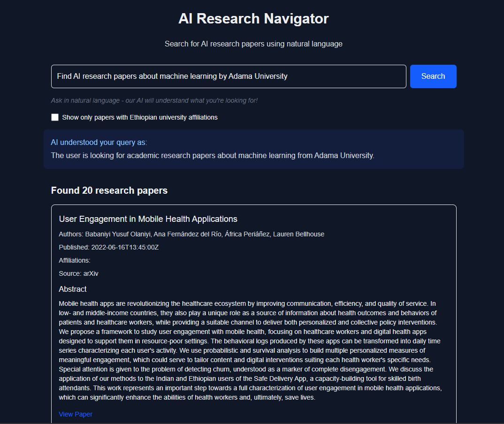

# AI Research Navigator

A knowledge navigator for AI research papers that uses natural language processing to interpret search queries and find relevant papers from arXiv and Semantic Scholar.



_Screenshot of the AI Research Navigator showing search results with the LLM's interpretation_


_Screenshot showing the detailed search interface with natural language query processing_

## Features

- **Natural Language Search**: Use everyday language to search for research papers
- **LLM-Powered Query Understanding**: Leverages Ollama's local LLM to interpret search queries
- **Multiple Data Sources**: Searches both arXiv and Semantic Scholar
- **Comprehensive Results**: Fetches up to 100 results from each source with pagination
- **Paper Details**: View abstracts, authors, affiliations, and download links
- **Graceful Fallback**: Works even without LLM by using regex-based query parsing

## Tech Stack

- **Frontend**: Next.js with TypeScript and React
- **Styling**: Tailwind CSS
- **LLM Integration**: Ollama (local LLM, defaults to llama3)
- **API Integration**:
  - ArXivTool from beeai-framework for arXiv access
  - Custom implementation for Semantic Scholar API
- **Query Processing**: Natural language processing with local LLM

## Prerequisites

- Node.js 18+ and npm
- [Ollama](https://ollama.ai/) (optional, for enhanced query processing)

## Installation

1. Clone the repository:

   ```bash
   git clone https://github.com/yourusername/knowledge-navigator-tool.git
   cd knowledge-navigator-tool
   ```

2. Install dependencies:

   ```bash
   npm install
   ```

3. (Optional) Install Ollama for enhanced query processing:
   - Download and install [Ollama](https://ollama.ai/)
   - Pull the llama3 model:
     ```bash
     ollama pull llama3
     ```

## Running Locally

1. Start the development server:

   ```bash
   npm run dev
   ```

2. Open [http://localhost:3000](http://localhost:3000) in your browser

3. If using Ollama, ensure it's running in the background before starting the app

## How It Works

1. **Query Processing**:

   - User enters a natural language query
   - If Ollama is available, the query is sent to the local LLM for interpretation
   - The LLM extracts structured information (author, affiliation, topic, etc.)
   - If Ollama is not available, a fallback regex-based parser extracts information

2. **Search Execution**:

   - The processed query is used to search arXiv and Semantic Scholar
   - Results are combined, deduplicated, and sorted by relevance
   - Ethiopian affiliations are detected when present

3. **Results Display**:
   - Papers are displayed with title, authors, and affiliations
   - Users can expand entries to view abstracts and access links
   - Pagination allows browsing through large result sets

## LLM Integration

The application uses Ollama to run LLMs locally for query processing:

- **Default Model**: llama3
- **Host**: http://localhost:11434
- **Purpose**: Interprets natural language queries and extracts structured search parameters
- **Fallback**: If Ollama is not available, the application uses regex-based parsing

## API Integrations

### ArXiv

Uses the ArXivTool from beeai-framework to search for papers on arXiv.

### Semantic Scholar

Uses a custom implementation to search for papers on Semantic Scholar.

## Customization

- **Change LLM Model**: Edit the model name in `src/lib/queryProcessor.ts`
- **Adjust Result Limits**: Modify the maxResults parameters in the tool implementations
- **Add More Sources**: Implement additional tools following the pattern in `src/lib/tools/`

## License

[MIT](LICENSE)

## Acknowledgements

- [beeai-framework](https://github.com/i-am-bee/beeai-framework) for the ArXivTool
- [Ollama](https://ollama.ai/) for local LLM capabilities
- [arXiv](https://arxiv.org/) and [Semantic Scholar](https://www.semanticscholar.org/) for research paper data
